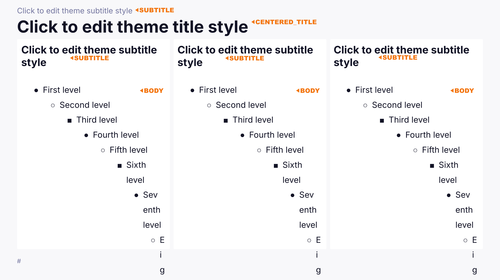
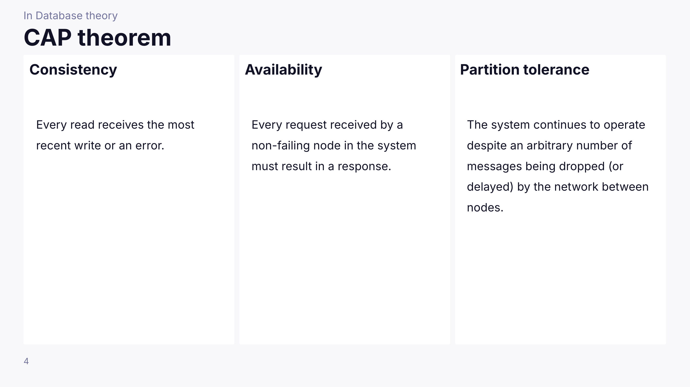
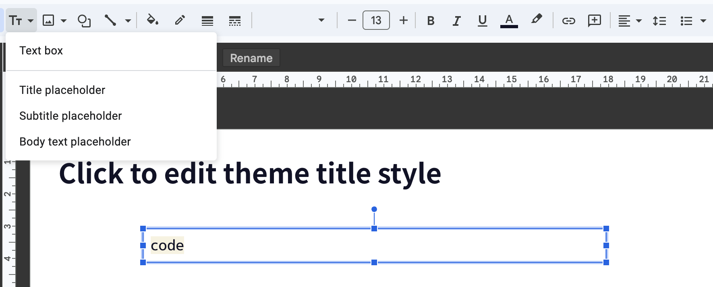

<p align="center">

</p>

# deck

[](https://github.com/k1LoW/deck/actions/workflows/ci.yml)   [](https://deepwiki.com/k1LoW/deck)

`deck` is a tool for creating deck using Markdown and Google Slides.

## Key concept

- **Continuous deck building**
    - Generate and modify deck iteratively.
- **Separate content and design**
    - Markdown for content, Google Slides for design.

## Usage

### Setup

#### Get and set your OAuth client credentials

- Create (or reuse) a developer project at https://console.cloud.google.com.
- Enable `Google Slides API` and `Google Drive API` at [`API & Services` page](https://console.cloud.google.com/apis/dashboard).
- Go to `Credentials` page and click `+ CREATE CREDENTIALS` at the top.
- Create `OAuth client ID` type of credentials.
- Choose type `Desktop app`.
- Download credentials file to `~/.local/share/deck/credentials.json` ( or `${XDG_DATA_HOME}/deck/credentials.json` ).

### Get presentation ID

#### When using an existing presentation

Get the presentation ID you want to operate. You can get a list with `deck ls`.

For example, presentation ID is `xxxxxXXXXxxxxxXXXXxxxxxxxxxx` of https://docs.google.com/presentation/d/xxxxxXXXXxxxxxXXXXxxxxxxxxxx/edit .

#### When creating a new presentation

You can create a new presentation with the deck new command and obtain the presentation ID.

If you want to apply a theme, specify the presentation ID of a presentation that is already using that theme with the `--from` option.

```console
$ deck new --from yyyyyyyYYYYyYYYYYYYyyyyyyyyy --title "Talk about deck"
xxxxxXXXXxxxxxXXXXxxxxxxxxxx
```

You can also specify a markdown file:

```console
$ deck new presentation.md --title "Talk about deck"
Applied frontmatter to presentation.md
xxxxxXXXXxxxxxXXXXxxxxxxxxxx
```

This will create (or update) the specified markdown file with frontmatter containing the presentation ID and title.

### Write deck in markdown

The slide pages are represented by dividing them with horizontal lines `---`.

> [!NOTE]
> The `---` at the beginning of the markdown is ignored.

### Apply deck written in markdown to Google Slides presentation

```console
$ deck apply deck.md --presentation-id xxxxxXXXXxxxxxXXXXxxxxxxxxxx
```

If your markdown file includes `presentationID` in the frontmatter, you can use the simplified syntax:

```console
$ deck apply deck.md
```

#### Watch mode

You can use the `--watch` flag to continuously monitor changes to your markdown file and automatically apply them to the presentation:

```console
$ deck apply --watch deck.md --presentation-id xxxxxXXXXxxxxxXXXXxxxxxxxxxx
```

Or with frontmatter:

```console
$ deck apply --watch deck.md
```

This is useful during the content creation process as it allows you to see your changes reflected in the presentation in real-time as you edit the markdown file.

> [!NOTE]
> The `--watch` flag cannot be used together with the `--page` flag.

## Support markdown rules

### YAML Frontmatter

`deck` accepts YAML frontmatter at the beginning of your markdown file.

```markdown
---
presentationID: xxxxxXXXXxxxxxXXXXxxxxxxxxxx
title: Talk about deck
---

# First Slide

Content...
```

The frontmatter must be:
- At the very beginning of the file
- Enclosed between `---` delimiters
- Valid YAML syntax
- Use `camelCase` for fields used in `deck` settings

#### Available fields

- `presentationID` (string): Google Slides presentation ID. When specified, you can use the simplified command syntax.
- `title` (string): title of the presentation. When specified, you can use the simplified command syntax.
- `breaks` (boolean): Control how line breaks are rendered. Default (`false` or omitted) renders line breaks as spaces. When `true`, line breaks in markdown are rendered as actual line breaks in slides.

### Insertion rule

`deck` inserts values according to the following rules regardless of the slide layout.

- The shallowest heading level within each slide content is treated as the title and inserted into the title placeholder ( `CENTERED_TITLE` or `TITLE` ) in order.
  - In most cases, this will be H1 (`#`), which is the standard for slide titles
- The next heading level (minimum level + 1) is treated as the subtitle and inserted into the subtitle placeholder ( `SUBTITLE` ) in order.
  - When H1 is used for titles, H2 (`##`) becomes the subtitle
- All other items are inserted into the body placeholder ( `BODY` ) in order.
    - The remaining contents are divided into one or more bodies by headings corresponding to the title or subtitle in the slide.

For example:
- **Standard case**: If a slide contains `#` (H1), then `#` becomes title and `##` becomes subtitle
- **Alternative case**: If a slide only contains `##` (H2) or deeper, then `##` becomes title and `###` becomes subtitle

> [!NOTE]
> They are inserted in the order they appear in the markdown document, **from the placeholder at the top of the slide** (or from the placeholder on the left if the slides are the same height).
>
> Also, if there are not enough placeholders, the remaining contents will not be rendered.

#### Input markdown document

```markdown
# CAP theorem

## In Database theory

## Consistency

Every read receives the most recent write or an error.

## Availability

Every request received by a non-failing node in the system must result in a response.

## Partition tolerance

The system continues to operate despite an arbitrary number of messages being dropped (or delayed) by the network between nodes.
```

#### Layout and placeholders



#### Result of applying



### Support syntax in body

- Bold ( `**bold**` )
- Italic ( `*italic*` `__italic__` )
- List ( `-` `*` )
- Ordered list ( `1.` `1)` )
- Link ( `[Link](https://example.com)` )
- Angle bracket autolinks ( `<https://example.com>` )
- Code ( <code>\`code\`</code> )
- `<br>` (for newline)
- Image (`` )
- Block quote ( `> block quote` )
- RAW inline HTML (e.g., `<mark>`, `<small>`, `<kbd>`, `<cite>`, `<q>`, `<span>`, `<u>`, `<s>`, `<sub>`, `<sup>`, `<var>`, `<samp>`, `<data>`, `<dfn>`, `<time>`, `<abbr>`)

#### Line break handling

By default, single line breaks in markdown are rendered as spaces in the slides, following the original Markdown and CommonMark specifications. You can change this behavior by setting `breaks: true` in the frontmatter:

```markdown
---
breaks: true
---

This text has a
line break that will
render as an actual line break.
```

When `breaks: true` is set, line breaks in the markdown source are preserved as line breaks in the rendered slides, similar to how GitHub renders markdown on their website.

When `breaks: false` (default), you can still create line breaks by using:
- Hard line breaks: add two spaces at the end of a line (standard Markdown/CommonMark syntax)
- HTML: use `<br>` tags

#### Style for syntax

Create a layout named `style` and add a `Text box` to enter specific word. The styles (`bold`, `italic`, `underline`, `backgroundColor`, `foregroundColor`, `fontFamily`) will be applied as the style for each Markdown syntax.



| Word | |
| --- | --- |
| `bold` | style for **bold**. |
| `italic` | style for *italic*. |
| `link` | style for [link](#). |
| `code` | style for `code`. |
| `blockquote` | style for block quote. |
| HTML element names | style for content of inline HTML elements ( e.g. `<cite>`, `<q>`, etc. ) |
| (other word) | style for content of inline HTML elements with matching class name ( e.g. `<span class="notice">THIS IS NOTICE</span>` ) |

#### Code blocks to images

By using the `--code-block-to-image-command (-c)` option, you can convert [Markdown code blocks](testdata/codeblock.md) to images. The specified command is executed for each code block, and its standard output is treated as an image.

```console
$ deck apply --code-block-to-image-command "some-command" -i xxxxxXXXXxxxxxXXXXxxxxxxxxxx deck.md
```

The command is executed with `bash -c`.
The command must output image data (PNG, JPEG, GIF) to standard output.

##### How to receive values

From code blocks like the following, you can obtain the optional language identifier `go` and the content within the code block.

    ```go
    package main

    import "fmt"

    func main() {
    	fmt.Println("Hello, 世界")
    }
    ```

There are three ways to receive code block information within the command:

1. **Receive from standard input**
   - The content of the code block is passed as standard input
   - The optional language identifier cannot be obtained, so use it in combination with other methods

2. **Receive as environment variables**
   - `CODEBLOCK_LANG`: Optional language identifier of the code block (e.g., `go`, `python`)
   - `CODEBLOCK_CONTENT`: Content of the code block
   - `CODEBLOCK_OUTPUT`: Path to a temporary output file

3. **Receive with template syntax ( with [expr-lang](https://expr-lang.org/) )**
   - `{{lang}}`: Optional language identifier of the code block
   - `{{content}}`: Content of the code block
   - `{{output}}`: Path to a temporary output file
   - `{{env.XXX}}`: Value of environment variable XXX

These methods can be used in combination, and you can choose the appropriate method according to the command requirements.

> [!NOTE]
> When `{{output}}` is not specified, deck reads the image data from the command's stdout. When `{{output}}` is specified, the command should write the image to that file path, and deck will read the image data from that file.

##### Examples

```console
# Convert Mermaid diagrams to images
$ deck apply -c 'mmdc -i - -o {{output}} --quiet' -i xxxxxXXXXxxxxxXXXXxxxxxxxxxx deck.md
```

```console
# Generate code images with syntax highlighting (e.g., silicon)
$ deck apply -c 'silicon -l {{lang == "" ? "md" : lang}} -o {{output}}' -i xxxxxXXXXxxxxxXXXXxxxxxxxxxx deck.md
```

```console
# Use different tools depending on the language
$ deck apply -c 'if [ {{lang}} = "mermaid" ]; then mmdc -i - -o {{output}} --quiet; else silicon -l {{lang == "" ? "md" : lang}} --output {{output}}; fi' -i xxxxxXXXXxxxxxXXXXxxxxxxxxxx deck.md
```

### Comment

The comments `<!--` `-->` are used as a speaker notes or page config.

## Page config

If the comment `<!--` `-->` can be JSON-encoded, it will be processed as page config.

```markdown
<!-- {"layout": "title-and-body"} -->
```

### `"layout":`

It is possible to specify the page layout.

The layout name (e.g. `title-and-body`) is specified.

```markdown
<!-- {"layout": "title-and-body"} -->
```


> [!TIP]
> With `deck ls-layouts` it is possible to obtain a list of the layout names for a specific presentation.
>
> ```console
> $ deck ls-layouts -i xxxxxXXXXxxxxxXXXXxxxxxxxxxx
> title
> section
> section-dark
> title-and-body
> title-and-body-half
> title-and-body-2col
> title-and-body-3col
> ```

### `"freeze":`

It is possible to skip the operation of the target page.

> [!TIP]
> If you set it to a page that has been completed with layout and design, the page will not be modified unnecessarily by deck.

```markdown
<!-- {"freeze": true} -->
```

### `"ignore":`

It is possible to exclude the target page from slide generation.

> [!TIP]
> Use this for draft pages, notes, or content that you don't want to include in the presentation.

```markdown
<!-- {"ignore": true} -->
```

### `"skip":`

It is possible to skip the target page during presentation.

> [!TIP]
> The slide will be created in Google Slides, but during presentation it will not be displayed and automatically advance to the next slide. Use this for slides that are temporarily unused or planned for future use.

```markdown
<!-- {"skip": true} -->
```

## Integration

- [zonuexe/deck-slides.el](https://github.com/zonuexe/deck-slides.el) ... Creating deck using Markdown and Google Slides.

## With AI agent

By collaborating with AI agents to create Markdown-formatted slides, you may be able to create effective presentations.

For example, it is a good idea to provide the following rules for creating deck slides in the prompt.

    Create a presentation in Markdown according to the following rules.

    # Rules for describing presentations using Markdown

    Unless otherwise specified, please follow the rules below.

    ## Basic Structure
    - Use `---` (three hyphens) to indicate page breaks between slides.
    - Within each slide, the minimum heading level will be treated as the title, and the next level as the subtitle. Higher level headings will be treated as body content. It is recommended to use only one title heading per slide.

    ## YAML Frontmatter
    You can include YAML frontmatter at the beginning of the file:
    ```yaml
    ---
    title: "Presentation Title"
    presentationID: "presentation_id"
    breaks: true
    author: "Author Name"
    date: "2024-01-01"
    tags: ["tag1", "tag2"]
    custom:
      nested: "value"
      number: 42
    ---
    ```

    ## Supported Markdown Syntax
    The following syntax can be used in the slide content:

    ### Text Formatting
    - **Bold** (`**bold**`)
    - *Italic* (`*italic*` or `__italic__`)
    - `Inline code` (<code>\`code\`</code>)
    - Combined formatting (e.g., ***bold and italic***)

    ### Lists
    - Bullet lists (`-` or `*`)
    - Numbered lists (`1.` or `1)`)
    - Nested lists (with proper indentation)
    - Alphabetical lists (a. b. c.)

    ### Links and Images
    - Links (`[Link text](https://example.com)`)
    - Angle bracket autolinks (`<https://example.com>`)
    - Images (``)
    - Supports PNG, JPEG, GIF formats
    - Supports both local files and URLs (HTTP/HTTPS)

    ### Block Elements
    - Block quotes (`> quoted text`)
    - Nested block quotes
    - Code blocks with language specification:
      ```language
      code content
      ```
    - Mermaid diagrams (in code blocks with `mermaid` language)

    ### HTML Elements
    You can use the following HTML inline elements:
    - `<strong>`, `<em>`, `<b>`, `<i>`, `<mark>`, `<small>`
    - `<code>`, `<kbd>`, `<cite>`, `<q>`, `<ruby>`, `<rt>`
    - `<span>`, `<u>`, `<s>`, `<sub>`, `<sup>`, `<var>`
    - `<samp>`, `<data>`, `<dfn>`, `<time>`, `<abbr>`, `<rp>`
    - `<br>` (for line breaks)
    - Use `class` attribute for custom styling

    ### Line Break Handling
    - Default (`breaks: false`): Soft line breaks become spaces
    - With `breaks: true`: Soft line breaks become actual line breaks
    - Use `<br>` tags for explicit line breaks

    ## Page Configuration
    Use HTML comments for page settings and speaker notes:
    - Page settings: `<!-- {"layout": "title-and-body"} -->`
    - Available settings: `"freeze": true`, `"ignore": true`, `"skip": true`
    - Speaker notes: `<!-- This is a speaker note -->` (use separate comments for notes)

    ## Important Notes
    - If a comment (`<!-- -->`) contains JSON, it's a page setting - do not overwrite it
    - If `"freeze": true` is present in page settings, do not modify that page content at all
    - Write speaker notes in separate comments, not in JSON configuration comments
    - Code blocks can be converted to images using the `--code-block-to-image-command` option


## Install

**homebrew tap:**

```console
$ brew install k1LoW/tap/deck
```

**go install:**

```console
$ go install github.com/k1LoW/deck/cmd/deck@latest
```

**manually:**

Download binary from [releases page](https://github.com/k1LoW/deck/releases)

## Alternatives

- [googleworkspace/md2googleslides](https://github.com/googleworkspace/md2googleslides): Generate Google Slides from markdown

## License

- [MIT License](LICENSE)
    - Include logo as well as source code.
    - Only logo license can be selected [CC BY 4.0](https://creativecommons.org/licenses/by/4.0/).
    - Also, if there is no alteration to the logo and it is used for technical information about deck, I would not say anything if the copyright notice is omitted.
