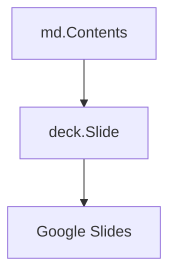

# Code Block

```go
package main

import "fmt"

func main() {
	fmt.Println("Hello, 世界")
}
```

```ts
const anExampleVariable = "Hello World"
console.log(anExampleVariable)
```



```
Hello World
```

<!-- {"layout":"title-and-body"} -->
